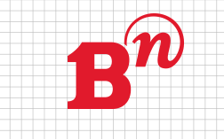
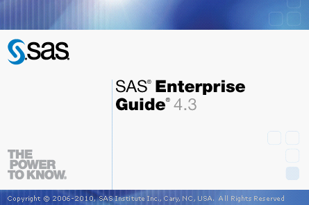
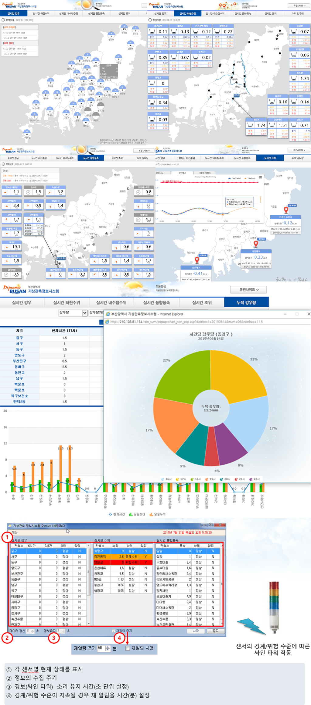
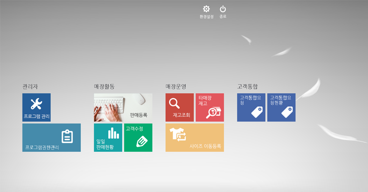

# Portfolio

- 이름 : 지준삼
- 나이 : 1984년생 (36)

- 경력

  - 웹 개발 약 5년
  - C/S 개발 약 2년

- 주 언어 및 보조 언어
  - JAVA, JSP, JavaScript, HTML, CSS, Vue.js, VisualBasic, C#
  - Oracle, MSSQL

- 경력

  - [Bn그룹 전산실 (2011.11 ~ 2013.09)](#Bn)
  
  - [세정그룹 세정I&C (2013.10 ~)](#세정-ic)
  
  
  
  ## Bn
  
  

  ### 주요 수행 업무 

  - ERP개발 및 운영
  
  - 그룹웨어 시스템 운영 (IBM Lotus Notes Solution)

  ### 프로젝트

  #### ▷Cargo System
  
  - B/L관리, Order관리, 세금계산서관리 프로그램 개발
  
    `C# ASP.NET, MSSQL, DevExpress Component`
  
   
  #### ▷CCM ( 골프장 통합관리 - 레이포드CC )
  
  - 직원관리, 캐디관리, 회원관리, 예약/문자발송 시스템 개발
  
    `VB.NET, Oracle, Farpoint Spread` 

  #### ▷자산관리 시스템
  
  - 전사 통합 자산관리 (자산등록, 자산지급, 자산반납, 자산이동, 자산폐기 등)
  
    `VB.NET, MSSQL, Farpoint Spread`
  
   
  
  
  
  ## 세정 I&C
  
  
  
  ### 주요 수행 업무 

  - ERP(인사,회계 모듈) / e-HR 시스템 개발 및 운영
  - 그룹웨어(EnterprisePotal) 개발 및 운영
  - ITSM 아웃소싱 (매출/매입 계약 및 업체 관리)
  
  ### 프로젝트
  
  #### ▷BI 도입/구축
  
  
  
  - 그룹 관계사 D/W(DatawareHouse) 디자인/설계
  
    `Oracle, SAS Solution`

  #### ▷기상관측 정보 시스템 구축
  
  
  
  - 부산시 강우, 수위, 조위, 풍향풍속 센서 데이터 수집 및 실시간 모니터링 시스템 개발
  
  - 경계/위험 수준에 따른 상황 싸인타워 작동 및 담당자 문자 발송을 위한 MiddleWare 개발
  
    `ASP + FusionCharts, C#.NET, Tebero DB, MySQL`
    
  #### ▷POS Framework 개발
  
  
  
  -  C/S 프레임워크 개발 (Web POS의 브라우저 환경에 따른 다양한 문제점 보완 및 성능 향상) 
  
    `C#.NET + DevExpress Famework, JAVA(Rest API), Oracle`

