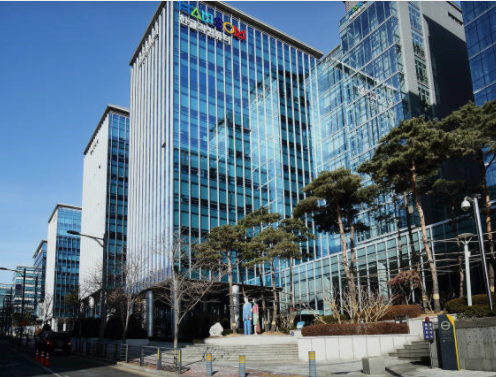

# Portfolio

- 이름 : 지준삼 (1984년생)

- 직무 경력 : 2013.10.01 ~ 재직중

- Skill & Tool
  - Java, JavaScript, VisualBasic, C#
  - Spring, SpringBoot, .NET
  - Oracle, MSSQL
  - Git, Docker, Jenkins

- 경력
  
  - [세정그룹 세정I&C (2013.10 ~ 2019.08)](#세정-ic)

  - [(주)한글과컴퓨터 (2019.09 ~)](#한글과컴퓨터)
    
  
  
  ##
  # 세정 I&C
  
  
  
  ### 주요 수행 업무 

  - ERP(인사,회계 모듈) / e-HR 시스템 개발 및 운영
  - 그룹웨어(EnterprisePotal) 개발 및 운영
  - ITSM 아웃소싱 (매출/매입 계약 및 업체 관리)
  
  ### 프로젝트
  
  #### ▷BI 도입/구축
  
  
  
  - 그룹 관계사 D/W(DatawareHouse) 디자인/설계
  
    `Oracle, SAS Solution`

  #### ▷기상관측 정보 시스템 구축
  
  
  
  - 부산시 강우, 수위, 조위, 풍향풍속 센서 데이터 수집 및 실시간 모니터링 시스템 개발
  
  - 경계/위험 수준에 따른 상황 싸인타워 작동 및 담당자 문자 발송을 위한 MiddleWare 개발
  
    `ASP + FusionCharts, C#.NET, Tebero DB, MySQL`
    
  #### ▷POS Framework 개발
  
  
  
  -  C/S 프레임워크 개발 (Web POS의 브라우저 환경에 따른 다양한 문제점 보완 및 성능 향상) 
  
    `C#.NET + DevExpress Famework, JAVA(Rest API), Oracle`
      
  #### ▷기간계 시스템 연계
  
  -  통합쇼핑몰 구축, 복합 쇼핑몰 구축에 따른 그룹사 기간계 시스템 연계 프로젝트 수행 
  
    `JAVA, JSP, Spring, C#.NET, REST API, Oracle`

  #### ▷e-HR 시스템
  
  -  그룹내 주요(3사) 계열사 성과평가 개편 및 역량평가 신규 개발
  -  그룹내 e-HR시스템 통합(인사,급여,연말정산 통합,평가시스템 통합, 조직관리 등) 
  
    `JAVA, JSP, Webix, Spring, Mybatis, Oracle`

  ##
  # 한글과컴퓨터
  
  

  ### 주요 수행 업무 

  - ERP (영림원 K-System) 커스텀 개발 및 운영
  - eHR시스템 개발 및 운영
  - CRM(총판/대리점 영업관리)운영
  - 내/외부시스템 API 연동 개발 및 운영

  ### 프로젝트
 
  #### ▷CRM
  
  - 채널웹 고도화
  - RESTfulAPI 개발
  - ERP시스템 연동 개발

  `JAVA, SpringBoot, Docker, Jenkins, PostgreSQL`

##
## [처음으로](#Portfolio)
